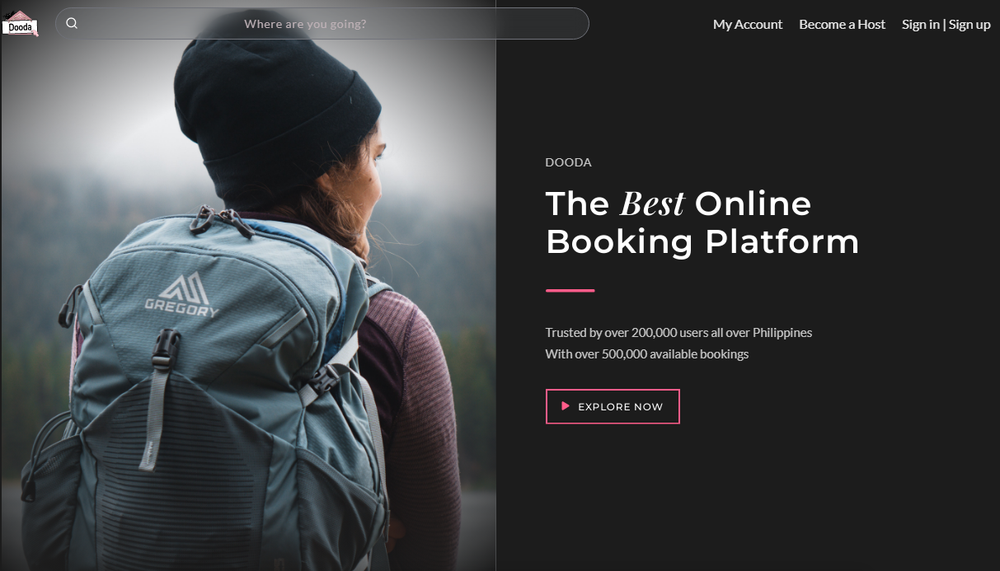
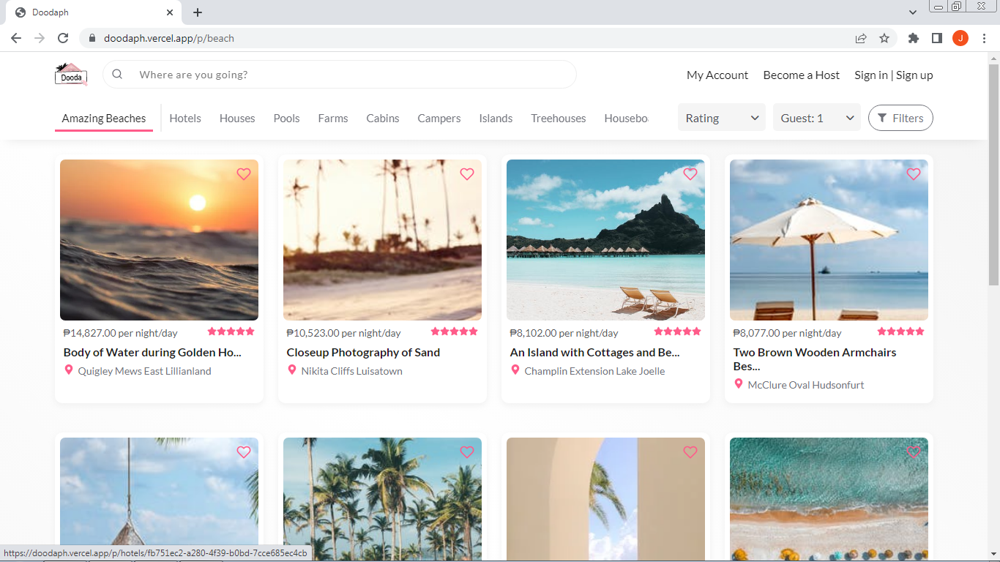

## DoodaPh (booking app)

A booking app built with react. It is fully responsive and looks good at mobile viewport.
Dooda has similar functionalities with Airbnb. It lists destinations and places for booking.
This particular project is frontend only. Data are fetch in mock API only since there is still no backend for it.

[See project live](https://doodaph.vercel.app/)

## Technology used

* React JS 
* Sass
* React Router Dom v6
* Animation libraries (GSAPP)

## Features 

* Responsive design
* Animations
* Infinite Scrolling / Lazy Loading
* Item filtering and searching
* Skeleton loading

## Project Screen Shots

 
 

## Installation and Setup Instructions

Clone down this repository. You will need `node` and `npm` installed globally on your machine.  

Installation:

`npm install` 

View in browser:

`npm start`  

## Reflection

  This is the project i made during my intership at Samjang Food Inc. I design it and built from scratch.
  
  Designing an apealing and modern looking website is challenging. I made two other design of this until i come up with this final design and my boss and i are satisfied with the end result.
  
  I decide to use react because it will become big soon. I have to make it scalable and react is my best choice. Integrating it to the backend will be very easy. 

  Overall, building this ecommerce project was fun. It really test my frontend UI/UX skills.